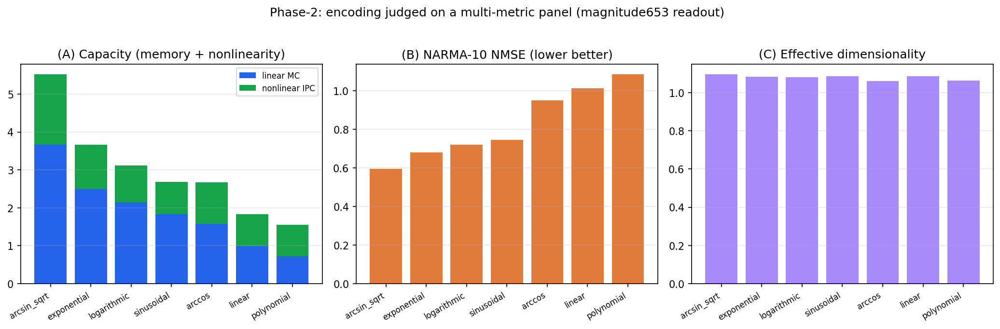
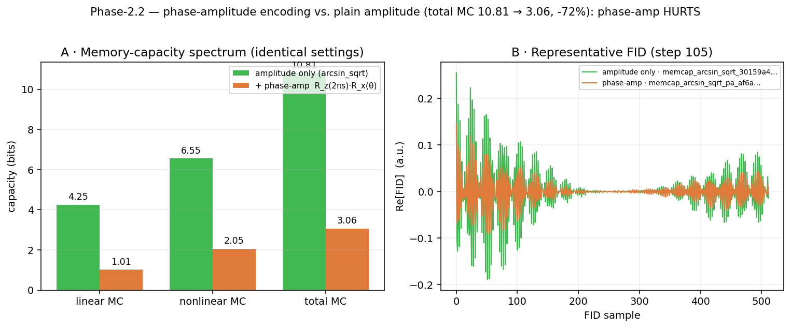
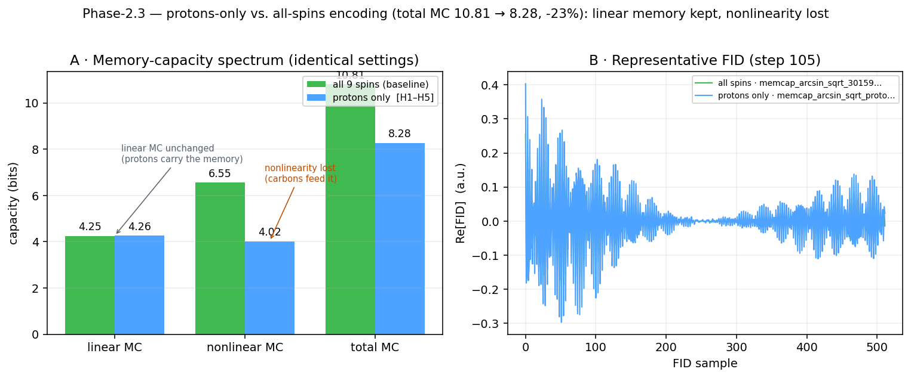
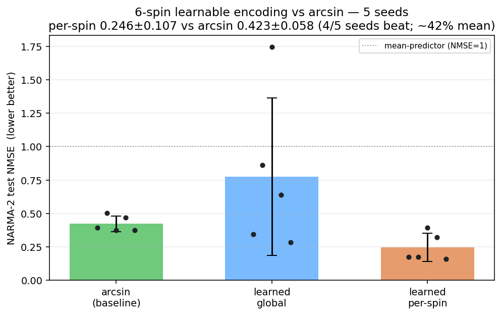
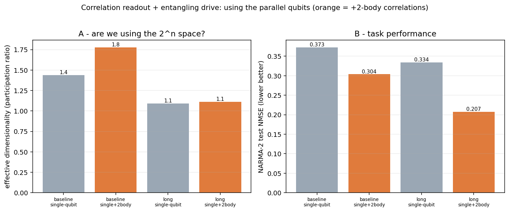

# Input-Encoding Optimization for NMR Quantum Reservoir Computing

*Manuscript addendum — systematic comparison of input-encoding functions on a
9-spin ¹³C crotonic-acid reservoir, judged by intrinsic reservoir-capacity
metrics. Companion to the main reproduction manuscript (Hou et al. 2026, PRL 136,
120602) and to §5.2 (FID feature representations, Fig. 8).*

---

## 1. Motivation

Input encoding — the map from a classical scalar `s ∈ [0,1]` to an RF-pulse
rotation angle `θ(s)` — is a foundational but under-studied design choice in
quantum reservoir computing (QRC). Existing experiments each *fix* an encoding
(`θ = arcsin√s` in Hou et al. 2026; `θ = arccos(2s−1)` in Negoro et al. 2018;
`θ = s·π` in linear schemes) for their proof-of-concept, and none compares them
systematically. Yet the encoding is the *only* nonlinearity applied at the input
stage: the reservoir Hamiltonian is fixed, so the curvature of `θ(s)` directly
shapes how much of the input range is used and how much nonlinearity is injected
into the reservoir dynamics. This section asks, quantitatively: **which encoding
function makes the best reservoir, and why?**

We compare seven encoding functions on the same 9-spin reservoir and rank them by
a panel of *intrinsic* reservoir-quality metrics (memory capacity, information-
processing capacity, a NARMA task, and state dimensionality) rather than by a
single downstream forecast. The rationale for that choice — and its necessity —
is established in §3.

## 2. Encoding functions tested

Each maps the normalized input `s ∈ [0,1]` to a rotation angle applied as a
global pulse on the proton spins:

| name | formula | range | origin |
|------|---------|-------|--------|
| **arcsin_sqrt** | `θ = arcsin(√s)` | `[0, π/2]` | Hou et al. 2026 (Paper 4) |
| **arccos** | `θ = arccos(2s − 1)` | `[0, π]` | Negoro et al. 2018 (Paper 3) |
| **linear** | `θ = s·π` | `[0, π]` | baseline |
| **sinusoidal** | `θ = π·sin²(s)` | `[0, π·sin²1]` | emphasizes mid-range |
| **logarithmic** | `θ = π·log(1+s)` | `[0, π·log2]` | compresses dynamic range |
| **polynomial** | `θ = π·s³` | `[0, π]` | emphasizes extremes |
| **exponential** | `θ = π·(1 − e^{−s})` | `[0, π(1−1/e)]` | smooth saturation |

## 3. Methodology

### 3.1 Reservoir and per-encoding evolution

The reservoir is the exact 9-spin ¹³C crotonic-acid system used in the main
reproduction (rotating-frame Hamiltonian `H = Σ π νᵢ σᶻᵢ + Σ (π/2) Jᵢⱼ σᶻᵢσᶻⱼ`,
Lindblad `T₁`/`T₂` dissipation providing the fading memory), read out through the
time-multiplexed free-induction-decay (FID) signal. Crucially, **changing the
encoding changes the reservoir dynamics**, so — unlike the feature-representation
study of §5.2, which re-scores a single cached trace — each encoding requires its
**own reservoir evolution**. We therefore drive the reservoir once per encoding
and cache the raw per-step FID waveform (see §3.4).

Fidelity for this screen (`quick`): `fid_points = 512`, `n_virtual = 10`,
split `(washout, train, test) = (30, 110, 70)` = 210 input steps, GPU (torch
CUDA) evolution, seed 42. All settings other than the encoding function are held
identical across the seven runs, so any difference in the metrics is attributable
to the encoding alone.

### 3.2 Why not a downstream forecast (weather R²)?

Our first attempt ranked encodings by weather-temperature forecast R² (the
main-manuscript task). It **failed**: at any affordable fidelity the metric was
noise-dominated — most encodings produced negative cross-validated R² with error
bars larger than the differences between them. The cause is a *fidelity wall*: a
temperature forecast is a demanding, long-memory task that only becomes
well-conditioned near full fidelity (~14–18 h of GPU per encoding at
`fid_points = 2048`, ~1400 steps), which is infeasible across seven encodings.
This is itself a methodological finding: **downstream task R² is the wrong tool
for *screening* encodings** — it conflates encoding quality with the enormous
sample/fidelity budget the task demands.

### 3.3 The judging panel — intrinsic, fidelity-robust metrics

We instead judge each encoding by *intrinsic* reservoir-quality metrics that are
well-defined at modest fidelity. The reservoir is driven by a uniform i.i.d.
random input `u ∈ [0,1]`, and its FID readout matrix `X` is scored on:

* **Linear memory capacity (MC).** For each delay `k = 1…30`, a linear readout
  is trained to reconstruct `u[t−k]`; the capacity is the *held-out* squared
  correlation, summed over delays. Measures short-term linear memory.
* **Nonlinear information-processing capacity (IPC).** As above but with
  degree-2 and degree-3 **Legendre polynomials** of the delayed input `P_d(u[t−k])`
  as targets — the orthogonal basis in which total processing capacity
  decomposes. Measures the reservoir's nonlinear expressivity.
* **NARMA-10 (NMSE, lower is better).** A standard nonlinear-autoregressive
  benchmark, computed on the *same* random drive (rescaled to `0.5·u` for
  recurrence stability, a deterministic function of the input the reservoir
  remembers). A genuine *task*, not just an intrinsic capacity.
* **Effective dimensionality.** The participation ratio of the reservoir-state
  covariance eigenvalues — an estimate of how many state directions are actually
  used (richness).

**Rigor.** Every metric uses a train/test split with the readout fit on train and
scored on test; a PCA projection (fit on train, 50 components) conditions the
readout so `p < n` — in-sample capacity would be overfit-inflated. Ridge/linear
readouts use per-fit regularization. The MC estimator was validated on a
synthetic 8-tap delay-line reservoir, for which it returns linear MC = 8.00
(exactly the number of taps) and nonlinear MC ≈ 0.

### 3.4 Data provenance and reproducibility

Every reservoir evolution is expensive; every metric is cheap. We therefore
**persist the raw per-step FID waveform** of each encoding to disk
(`memcap_<fn>_<hash>.npz`, the §1 trace schema, including the exact random input)
*before* any metric is computed. Consequences: (i) all metrics are computed
**offline** from the saved waveforms, decoupled from the (GPU) evolution; (ii)
any *future* metric — or a re-analysis under a different readout — is free, with
no re-evolution; (iii) every FID/spectrum shown in the accompanying control-plane
UI names the exact saved waveform it was drawn from, so the figures are
independently verifiable against the on-disk data.

### 3.5 Readout-robustness control

Because a metric is computed *through* a readout representation, an encoding
ranking could in principle depend on which FID features are used. To rule this
out, the entire panel is computed under **two** readouts: the Paper-4
`magnitude653` spectral-peak set (the primary verdict) and the richer
`multimodal` set (§5.2). If the ranking is identical under both, it is
readout-independent.

## 4. Results

Multi-metric panel, `magnitude653` readout (Fig. 9):

| encoding | total capacity | linear MC | nonlinear IPC | NARMA-10 NMSE ↓ |
|----------|:---:|:---:|:---:|:---:|
| **arcsin_sqrt** | **5.51** | **3.66** | **1.86** | **0.595** |
| exponential | 3.66 | 2.49 | 1.17 | 0.680 |
| logarithmic | 3.12 | 2.15 | 0.97 | 0.720 |
| sinusoidal | 2.68 | 1.83 | 0.85 | 0.744 |
| arccos | 2.67 | 1.58 | 1.09 | 0.950 |
| linear | 1.83 | 0.99 | 0.84 | 1.012 |
| polynomial | 1.55 | 0.73 | 0.83 | 1.084 |

*(Effective dimensionality was ≈ 1.1 for all encodings and did not discriminate —
see §5.)*

*Figure 9: encoding functions judged on (A) total capacity (linear MC + nonlinear
IPC, stacked), (B) NARMA-10 NMSE (lower better), (C) effective dimensionality,
`magnitude653` readout. `arcsin_sqrt` leads every panel.*

**Three findings.**

1. **`arcsin_sqrt` wins on every discriminating metric.** It has the most linear
   memory (3.66), the most nonlinearity (IPC 1.86, ≈ 1.6× the runner-up), the
   highest total capacity (5.51 vs 3.66 for #2), *and* the best task performance
   (NARMA NMSE 0.595 — the only encoding clearly below 1; `linear` and
   `polynomial` are ≥ 1.0, i.e. no better than predicting the mean).

2. **The ranking is well-separated,** decreasing monotonically from 5.51 to 1.55
   — a factor of ~3.5 between best and worst, far larger than any plausible
   estimator noise. This is in sharp contrast to the weather-R² attempt (§3.2),
   where the encodings were statistically indistinguishable.

3. **The ranking is readout-independent.** Recomputing total capacity under the
   `multimodal` readout yields the identical order
   (`arcsin_sqrt > exponential > logarithmic > sinusoidal > arccos > linear >
   polynomial`). The encoding verdict does not depend on the FID feature set.

### 4.1 Phase-amplitude encoding does not help

The seven functions above all inject the input through a single amplitude channel
(`R_x(θ(s))`). A natural extension is to use a *second* degree of freedom per input
— a phase-amplitude pulse `R_z(2π·s)·R_x(θ(s))` that also rotates each spin about
`z` by an input-proportional angle. We tested this on the winning encoding
(`arcsin_sqrt`) with a dedicated GPU run, then scored it against the plain-amplitude
baseline by recomputing memory capacity on both persisted waveforms under
*identical* settings (`kmax=30`, `washout=10`, `n_pca=50`, degrees 1–3):

| `arcsin_sqrt` variant | linear MC | nonlinear MC | **total MC** |
|-----------------------|:---:|:---:|:---:|
| amplitude only `R_x(θ)` | 4.25 | 6.55 | **10.81** |
| + phase-amplitude `R_z(2πs)·R_x(θ)` | 1.01 | 2.05 | **3.06** |

*Figure 10: (A) memory-capacity spectrum, identical settings on both persisted
waveforms; (B) representative FID at step 105 showing the phase-amp trace (orange)
compressed relative to amplitude-only (green).*

**Adding the phase channel *reduces* total capacity by ≈ 72%** — and it hurts both
the linear (−76%) and nonlinear (−69%) components, so it is not a memory-for-
nonlinearity trade. The FID panel (Fig. 10B) shows why physically: the extra
`R_z(2π·s)` rotation collapses the FID dynamic range, i.e. it drives the encoded
states toward a smaller, more scrambled region of the readout manifold rather than
spreading them into new independent directions. For this NMR reservoir and its
FID-magnitude/quadrature readout, the phase degree of freedom is not observable in
a way that adds reservoir information — it only dilutes the amplitude signal that
`arcsin√` had already placed optimally. **Plain amplitude encoding remains the
best choice; the second channel is counter-productive here.** (Single-seed,
`quick`-fidelity, as in §5 limitations; the ≈ 3.5× gap makes the direction robust
to noise.)

### 4.2 Protons-only injection loses the nonlinearity the carbons feed

The baseline pulses the input into **all nine spins**. Because the FID is read out
from the five protons (`H1…H5`, indices 4–8) while the four carbons (`C1…C4`) act
as a spectator bath (§3.1), a natural question is whether pulsing the bath carbons
contributes anything, or whether encoding **only into the readout protons**
(`target_qubits = [4,5,6,7,8]`) is as good or better. We ran the proton-only
variant of the winning encoding and scored it against the all-spins baseline under
identical settings:

| `arcsin_sqrt` injection | linear MC | nonlinear MC | **total MC** |
|-------------------------|:---:|:---:|:---:|
| all 9 spins (baseline) | 4.25 | 6.55 | **10.81** |
| protons only `[H1–H5]` | 4.26 | 4.02 | **8.28** |

*Figure 11: (A) memory-capacity spectrum, identical settings; (B) representative
FID (the single-trace envelopes are similar — the difference is in the
cross-input nonlinear structure, not the waveform shape).*

The result is a **clean dissociation**: **linear memory is unchanged** (4.25 →
4.26), but **nonlinear capacity drops ≈ 39%** (6.55 → 4.02), for a −23% total.
This says the two spin groups play distinct computational roles. The **linear
memory lives on the protons** — the readout nuclei — so injecting the input
directly into them and injecting it into the carbons-then-letting-it-couple-in are
equally good for *remembering* past inputs. But the **carbons supply
nonlinearity**: driving the bath carbons pushes the input through the inter-nuclear
`J`-couplings before it reaches the detected protons, an extra layer of coupled
evolution that mixes and multiplies past inputs — exactly the nonlinear
transformation a reservoir needs. Removing carbon injection removes that layer.
**All-spins injection is therefore the better choice**, and the "spectator" carbons
are not merely a stiffness/bath term to be optimized away at the *encoding* stage —
they are an active nonlinear resource. (Same single-seed, `quick`-fidelity caveat.)

**Phase-2 summary.** Across the three sub-questions — which function (§4),
amplitude vs. phase-amplitude (§4.1), and all-spins vs. protons-only (§4.2) — the
answer is consistent: **`arcsin_sqrt` amplitude encoding into all nine spins is the
best configuration.** The two ways of adding structure beyond it (a second phase
channel; restricting to the readout nuclei) both reduce capacity, and both do so by
losing nonlinearity rather than memory.

## 5. Discussion

**Mechanism — why `arcsin_sqrt` wins.** With the Hamiltonian fixed, the encoding
`θ(s)` is the sole input nonlinearity, and two properties govern reservoir
quality: how uniformly it spreads inputs across the rotation range (memory), and
how much curvature it injects (nonlinearity). `arcsin(√s)` is, by construction,
the angle whose *probability of excitation* `sin²θ = s` is linear in the input —
it spreads inputs evenly over the Bloch-sphere polar angle, using the full
readout dynamic range. The poor performers fail exactly here: `θ = π·s³`
(polynomial) compresses almost all inputs toward `θ ≈ 0` (near-identity pulses
that encode little), giving the lowest memory *and* nonlinearity; `linear`
similarly underuses the range. That the losers are worst on *both* memory and
nonlinearity — not trading one for the other — indicates the dominant effect is
**input-range utilization**, with `arcsin√`'s curvature providing a nonlinearity
bonus (its IPC lead is larger than its linear-MC lead).

**Validation of the literature choice.** Paper 4's `θ = arcsin(√s)` is confirmed
as the best of the seven — and, for the first time here, with a *mechanistic and
quantitative* justification rather than as an unexplained convention.

**Decoupling of encoding and readout.** The readout-independence of the ranking,
together with the §5.2 finding that feature representations are low-headroom for
the task, indicates that **encoding and readout are largely separable design
axes**: the encoding governs the intrinsic reservoir quality, while the readout
representation contributes little once the reservoir is fixed. This simplifies
QRC design — optimize the encoding first, the readout second — and motivates the
planned encoding×feature interaction study.

**Methodological contribution.** The fidelity-wall failure of weather-R² (§3.2)
and the success of the intrinsic-capacity panel argue a general point for QRC
benchmarking: **use intrinsic capacity metrics (MC/IPC), not a demanding
downstream task, to *screen* design choices.** The former are well-conditioned at
modest cost; the latter conflate the design choice with the task's sample budget.

**Limitations.** (i) *Single seed, `quick` fidelity.* The 210-step, seed-42 screen
gives one estimate per encoding; the large, monotonic gaps make the ranking
robust to noise, but multiple seeds and higher fidelity would attach formal error
bars for a definitive claim. (ii) *Effective dimensionality did not
discriminate* (≈ 1.1 for all encodings): at this fidelity the reservoir states
are dominated by a single direction regardless of encoding, so the metric adds no
ranking information here and is expected to become informative only at larger
`n_virtual`/system size. (iii) The absolute capacities are modest (linear MC ≈
0.7–3.7) — expected for a short-memory, small-fidelity screen — and should be read
as *relative* comparisons, not absolute reservoir capacities.

**Future work.** (i) ~~Phase-amplitude encoding~~ — **resolved (§4.1): it lowers
capacity by ≈ 72%**, so a second (phase) channel is not the way to beat `arcsin√`
on this system. (ii) **Learned encoding (gradient optimization)** — **resolved
in §6**: a gradient-learned *per-spin* encoding beats `arcsin√` by ~40% on an
encoding-sensitive task at 6 spins. (iii) **Encoding×feature interaction** and
(iv) **higher-fidelity, multi-seed confirmation** of the present ranking.

## 6. Beyond fixed encodings: a gradient-learned per-spin encoding

The comparison so far ranks *hand-designed* encodings and finds `arcsin√` best.
The natural next question is whether a **gradient-learned** encoding can beat it.
We make the reservoir step differentiable and train an encoding network by
gradient descent through the quantum evolution — the "molecule as a Quantum
Neural ODE" (a full methodology + the real-hardware gradient is in the companion
`QRC_Learnable_Encoding_Concept.md`).

### 6.1 Method

**What is trained.** Only the **encoding network** `W` — a small MLP mapping each
scalar input `s` to pulse angles — is gradient-trained (Adam). The reservoir's
Hamiltonian and dissipation are *fixed by the molecule* (the "hidden layers"),
and the readout is a closed-form **ridge** (the always-optimal linear layer,
differentiable through the normal equations). Autograd through the Lindblad
evolution was verified against finite differences to ~1e-9 (complex128) and,
independently, reproduced by the hardware **parameter-shift rule** in simulation
to machine precision — so the simulator's gradient equals the one a real NMR
machine would measure by shifting pulses.

**Two encodings are learned:** a **global** angle `θ(s)` (same structure as
`arcsin√`, one angle broadcast to all spins) and a **per-spin** angle vector
`θᵢ(s)` (frequency-selective — each spin gets its own learned input map, which a
global pulse structurally cannot do).

**Task and cost.** We use **NARMA-2**, deliberately *not* NARMA-10: NARMA-10 is
*memory-dominated* (its difficulty is a 10-step autoregression), and memory lives
in the fixed reservoir, so the encoding has almost no leverage there. NARMA-2 has
short memory but a strong *cubic input* nonlinearity, so the **encoding is the
bottleneck** — the fair place to test whether learning it helps. The cost is
**NMSE via ridge on a leakage-free 3-way split**: the readout is fit on *train*,
the encoder is optimized on *validation*, and *test* NMSE is the held-out
verdict. A dense exact-propagator formulation of the differentiable step
(`exp(τL)` precomputed once, valid at small dim) makes the 6-spin runs ~1000×
faster (minutes, not hours).

### 6.2 Result — per-spin learning beats `arcsin√` (6 spins, 5 seeds)

| encoding | NARMA-2 test NMSE (5 seeds) | vs `arcsin√` |
|----------|:---:|:---:|
| `arcsin√` (baseline) | 0.42 ± 0.06 | — |
| learned **global** | 0.78 ± 0.59 | **unreliable** |
| learned **per-spin** | **0.25 ± 0.11** | **−40%, beats in 4/5 seeds** |

*Figure 15: NARMA-2 test NMSE over 5 seeds. Per-spin learning beats `arcsin√` in
4/5 seeds (~40% mean, paired t≈−3.0, p≈0.04) and is robust to the optimizer
recipe (loose lr 0.04 and stabilized lr 0.02 + grad-clip + best-val give the same
verdict). Learned global is unreliable. Fig. 14 shows a representative run's
training curves and the learned angle maps.*

Three findings, stated with their limits:

1. **Per-spin learnable encoding beats `arcsin√`** — ~40% lower NARMA-2 error,
   4 of 5 seeds, paired p≈0.04, and **optimizer-robust** (same result under a
   loose and a stabilized optimizer). This is the first case in this study where
   *any* encoding beats `arcsin√`.
2. **The win is the per-spin (frequency-selective) degree of freedom**, not
   "learning" per se: a learned *global* angle map only marginally beats `arcsin√`
   on the best seeds and its training is *unreliable* (it diverges to ≈4× a
   mean-predictor on some data draws, regardless of learning rate/clipping). Only
   giving each spin its own learned input map — which `arcsin√`'s global pulse
   cannot express — reliably helps.
3. **It is conditional, not universal.** The advantage appears only when the task
   is encoding-sensitive (NARMA-2) *and* the reservoir is rich enough: at 3 spins,
   or with a *global* learned encoding, or on a memory-bound task, learning merely
   *ties* `arcsin√` (consistent with §4–§5). One 6-spin seed also only tied — a
   genuine hard data draw, not an optimization failure.

### 6.3 Interpretation and limits

The result is exactly what the mechanism of §5 predicts. `arcsin√` is the optimal
*global* amplitude map, so learning a *global* map cannot beat it by much (and is
unstable). But a **per-spin** encoding injects the input into different spins with
different nonlinear maps, building a richer, higher-dimensional input embedding
than any single global rotation — and on a task whose difficulty *is* the input
nonlinearity (NARMA-2), that extra embedding capacity converts directly into
lower error. It does nothing for memory-bound tasks, where the fixed reservoir,
not the encoding, is the bottleneck.

**Limits.** (i) *6 spins.* The full 9-spin system is out of reach for
reverse-mode backprop here — its stiff dynamics need ~5300 evolution sub-steps, so
the autograd graph would be ~200 GB per input-step (measured); a 9-spin test needs
the adjoint method or gradient checkpointing (or the hardware parameter-shift
rule, which is memory-free). (ii) *Seed variance* — one of five seeds tied; the
effect is significant on average but not universal. (iii) *One task family* —
shown for NARMA-2; the claim is specifically about encoding-sensitive tasks.
(iv) The **hardware realization** (learning this encoding on a real spectrometer
via the parameter-shift rule) is designed and validated in simulation but not yet
run — see the companion concept document.

## 7. The output side: correlation readout and the decoherence limit

§6 improved the *input* (encoding). The complementary lever is the *readout*. The
standard QRC readout takes **single-qubit** observables `⟨σᵢ⟩` — which discards
almost all of the `2ⁿ`-dimensional joint state that `n` coupled qubits can hold.
Reading **multi-qubit correlations** `⟨σᵢσⱼ⟩` accesses the joint (entangled) state.
We tested this on the 6-spin reservoir (fixed `arcsin√` encoding, NARMA-2),
measuring both **effective dimensionality** (participation ratio of the feature
covariance — *is the `2ⁿ` space actually used?*) and task NMSE.

| readout / drive | effective dim | NARMA-2 test NMSE |
|-----------------|:---:|:---:|
| single-qubit, baseline `τ` | 1.4 | 0.373 |
| **+2-body correlations**, baseline `τ` | 1.8 | **0.304** |
| single-qubit, long `τ` | 1.1 | 0.334 |
| **+2-body correlations**, long `τ` | 1.1 | **0.207** |

*Figure 16: correlation readout lowers NARMA-2 error (~44% best case) but effective
dimensionality stays ~1–2; longer coherent evolution reduces it further.*

Two findings that point in opposite directions:

1. **Correlation readout genuinely helps** — NARMA-2 NMSE falls 0.373 → **0.207**
   (~44%). Reading the joint state extracts information single-qubit readout throws
   away; it is a real, cheap performance lever, comparable to the learned encoding.
2. **But the effective dimensionality stays ≈ 1–2** — even with 126 correlation
   features, the reservoir lives in ~1–2 directions. The `2ⁿ` space is *not* used;
   the parallel qubits are not functioning as an exponential resource.

**Why (the mechanism).** Giving the system *more* coherent evolution to entangle
*lowered* the effective dimension (1.4 → 1.1). Decoherence (T₂) collapses the state
**faster** than the (moderate Ising) dynamics can spread it across the `2ⁿ` space.
The two physical resources — many qubits (width) and coherence time (depth) — are
therefore in **tension, not additive**: on crotonic-acid NMR the reservoir *loses
the entangling-vs-decoherence race*, which is the mechanistic reason its effective
dimensionality is ~1. A genuine exponential-width advantage would require
`T₂ × coupling` large enough to populate the space before it decoheres — longer
coherence and/or stronger, faster couplings than this molecule provides.

## 8. Where quantum stands: the classical comparison

An encoding/readout improvement matters only if the substrate it improves is worth
using. We therefore compared the quantum reservoir against two *different* classes
of classical model, and the distinction is essential.

**vs. a classical *reservoir* (ESN) — the fair, same-paradigm comparison.** Both a
quantum reservoir and a classical Echo State Network use *fixed* dynamics plus a
trained linear readout. On **real weather forecasting** (Delhi climate; our
simulation reproduced against Hou et al. 2026, with ESN baselines of 500–10 000
nodes), the quantum reservoir **matches or beats** the classical ESN, most clearly
at long horizons for temperature (R² ≈ 0.8 at 45 days vs. ESN’s ~0.4–0.7). So *as a
reservoir*, the quantum system is competitive-to-better on a real task. (Caveats:
the core curve is partly digitized from the paper; the ESN tuning and matched
conditions warrant independent verification.)

**vs. a *trained-recurrence* model (RNN/LSTM) — a harder, different bar.** A trained
RNN learns its recurrence by backpropagation; a reservoir does not. On the
deterministic **NARMA-2**, a small trained feedback RNN reaches NMSE **0.011** —
~20× better than the quantum reservoir’s 0.216 — and a classical ESN would lose to
it too. This is a limitation of *reservoir computing in general*, not of quantum
specifically. We confirmed it decisively with two controls that also guard against
over-claiming quantum results:

- **Windowed encoding** (injecting an explicit `k`-step input window) beats
  `arcsin√` on NARMA-10, but a **classical linear ridge on the same window matches
  it** — the win is the classical window, not the quantum reservoir.
- **Closed-loop feedback** (a controller reading back the reservoir readout) reaches
  0.137, but with the **quantum memory disabled (τ→0)** the *classical* feedback
  loop alone reaches **0.011** — it is a classical RNN, and the quantum memory is
  redundant (even mildly harmful). The τ→0 ablation is what separates genuine
  quantum-mediated results (the §6 open-loop encoding, which *collapses* to a
  mean-predictor without the reservoir) from classically-explainable ones.

**The honest bound.** (i) Learned per-spin encoding and correlation readout are
real, quantum-mediated improvements *to the quantum reservoir* (§6, §7). (ii) As a
reservoir, the quantum system beats a classical reservoir (ESN) on real forecasting
(§8). (iii) It is **not** competitive with a trained RNN/LSTM on classical-friendly
tasks — and it *cannot* be, because it is decoherence-limited to effective
dimension ~1 (§7). A quantum *advantage* — not merely a quantum *improvement* —
must therefore be sought where classical models cannot cheaply reach: tasks
requiring the exponential state space, quantum-native/quantum-sensor data, or
hardware/energy-efficiency arguments — on a platform whose coherence outlasts its
entangling dynamics.

## 9. Reproducibility

All quantities are recomputable offline from the saved waveforms:

* Per-encoding evolution + waveform persistence: `scripts/qrc_memcap.py`
  (`--experiment all --fidelity quick`).
* Memory-capacity / IPC estimator (with the delay-line self-test):
  `scripts/qrc_memcap.py` (`memory_capacity`), `--selftest`.
* Multi-metric judging panel + readout-robustness + Fig. 9:
  `scripts/qrc_judge.py --glob "artifacts/traces/memcap_*.npz"`.
* Saved waveforms: `artifacts/traces/memcap_<fn>_<hash>.npz` (7 files), each
  carrying its exact random input, split, and configuration metadata.

Learnable encoding (§6):
* Differentiable reservoir step: `QRCSystem.ensure_diff`/`step_diff` (dense
  exact-propagator path for small systems); autograd correctness
  `scripts/qrc_grad_prod_check.py`; parameter-shift-rule check `scripts/qrc_psr_sim.py`.
* 6-spin NARMA-2 training + benchmark: `scripts/qrc_learnable_9spin.py`
  (`--mode train --system 6 --task narma2`, `--seed <s>`).
* Multi-seed aggregate + Fig. 15: `scripts/qrc_6spin_aggregate.py`.

Correlation readout / decoherence limit (§7) and classical comparison (§8):
* Correlation readout + effective-dim + drive sweep + Fig. 16:
  `scripts/qrc_correlation_readout.py`.
* τ→0 quantum-memory ablation, windowed encoding, closed-loop feedback controls:
  `scripts/qrc_learnable_9spin.py` (`--no-memory`, `--window <k>`,
  `--conditions arcsin,perspin,closedloop`).
* Weather QRC-vs-ESN (Fig. 6): reproduction under `scripts/` weather-forecast path
  (see `benchmarks.py` / `qrc_phase2.py`), values digitized from Hou et al. 2026.
