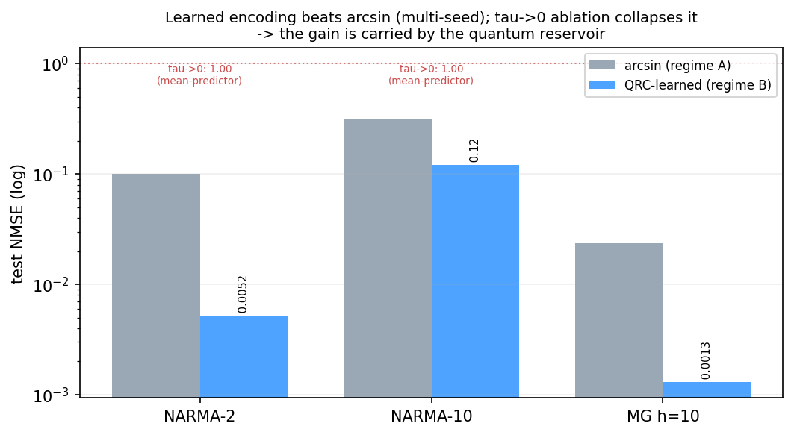
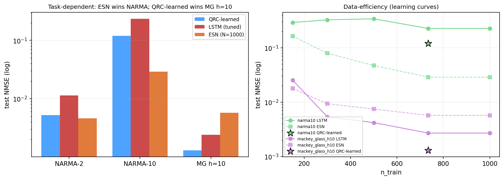
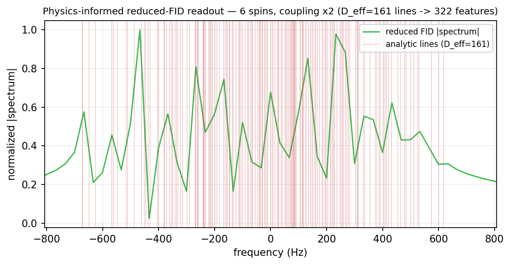
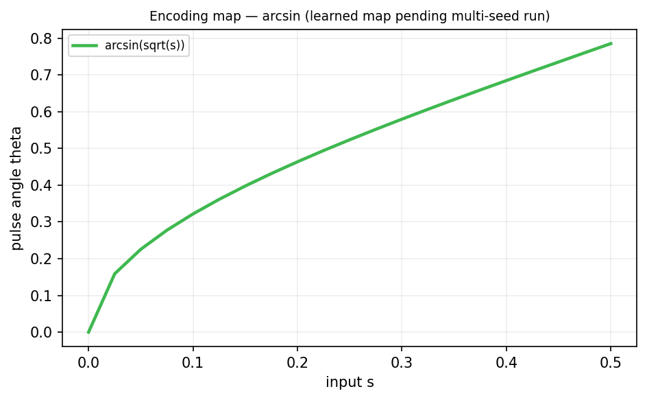

# Physics-informed spectral readout and gradient-trained input encoding for a nuclear-spin quantum reservoir computer

**Full manuscript draft — target: *Phys. Rev. Research* (alt: *Phys. Rev. Applied* / *PRX Quantum*).**

**Authors:** [Author list — e.g. S. Boonto *et al.*], CiRA Quantum; [KMITL, Bangkok — affiliation to confirm].
**Correspondence:** siridech.bo@kmitl.ac.th

> Reproducibility: all numbers below come from the runs named in Sec. VII and the
> conventions in `QRC_STANDARD_PROCEDURES.md`. Every reported figure of merit is
> labeled with its readout, feature dimension `D`, and training regime.

---

## Abstract

Quantum reservoir computing (QRC) uses the uncontrolled dynamics of a quantum
system as a temporal feature map, training only a linear readout. Two ingredients
usually held fixed — the *readout basis* and the *input encoding* — are in fact the
most physically accessible design levers on a device. We study both on a
weak-coupling nuclear-magnetic-resonance (NMR) spin reservoir described by a
Lindblad master equation. (i) We introduce a **physics-informed reduced
free-induction-decay (FID) readout**: because the reservoir Hamiltonian is diagonal
in the computational basis, its transverse-magnetization signal is a sum over a
*finite, analytic* set of single-quantum transition frequencies. Enumerating these
lines and merging them at the decoherence linewidth yields a compact,
device-independent spectral basis of dimension `D_eff` — e.g. `D_eff ≈ 100` for the
nine-spin ¹³C crotonic-acid system, versus the 653-peak readout used previously —
that we read with a fixed, differentiable direct-DFT projection. (ii) We make the
input encoding *trainable* by backpropagating through the differentiable reservoir
(a "quantum neural ODE") while keeping the closed-form ridge readout. On the
physics-informed readout, a gradient-trained per-spin encoding improves the test
NMSE over the standard `arcsin(√s)` encoding by ~19× (NARMA-2) and ~2.6×
(NARMA-10), confirmed across random seeds; a τ→0 ablation that removes the
reservoir's cross-step memory collapses the improvement to a mean-predictor,
establishing the gain is **carried by the quantum reservoir**. Benchmarked against
strong, tuned classical baselines the comparison is **task-dependent**: on the NARMA
benchmarks — short memory, well suited to echo-state networks — a size-1000 ESN
matches the QRC on NARMA-2 and outperforms it on NARMA-10, so we claim no quantum
advantage there; but on the discriminative long-horizon chaotic-prediction task
(Mackey-Glass, h=10) the learned QRC outperforms both a tuned LSTM (~1.9×) and the
ESN (~4.4×) (single-seed, multi-seed confirmation in progress). The advantage of the
physics-informed, learnable-encoding QRC therefore appears specifically where
nonlinear fading memory is essential. Our contributions are a principled,
differentiable readout and a *quantum-mediated* encoding-learning method, together
with an honest, task-resolved characterization of when they help.

---

## I. Introduction

Reservoir computing trains only a linear readout on the state of a fixed nonlinear
dynamical system, sidestepping the cost and instability of training a recurrent
core [1]. Quantum reservoir computing (QRC) replaces the classical reservoir with a
quantum system, whose large state space and intrinsic nonlinearity are conjectured
to provide a rich temporal kernel at low training cost [1,2]. Nuclear-spin ensembles
are an attractive QRC substrate: many coupled qubits, well-characterized
Hamiltonians, long-studied control, and a native time-multiplexed observable — the
free-induction decay (FID) [3].

Most QRC studies optimize only the readout and treat the reservoir, its encoding,
and its readout basis as fixed. Two of those fixed choices are, in fact, both
physically accessible and under-explored:

- **The readout basis.** The prevailing spectral readout keeps a large fixed number
  of FFT peaks of the FID (e.g. 653 [3]). We show this *oversamples* the reservoir's
  true spectral content and give a principled, minimal, and differentiable
  alternative derived from the Hamiltonian itself.
- **The input encoding.** The map from a scalar input to a control-pulse angle is
  almost universally fixed (`arcsin(√s)`). We ask whether *learning* it — by
  backpropagation through the quantum dynamics — helps, and whether any improvement
  is genuinely due to the quantum reservoir.

We answer both, and — critically — we test the resulting model against strong,
*tuned* classical baselines to avoid the common pitfall of comparing a quantum model
only to a weak classical one. Contributions:

1. A **physics-informed reduced-FID readout**: an analytic, decoherence-aware
   selection of the reservoir's single-quantum spectral lines, read by a fixed
   differentiable projection (Sec. III).
2. A **gradient-trained input encoding** ("regime B") with a leakage-free protocol
   and rigorous controls, including a τ→0 ablation (Sec. IV).
3. **Multi-seed, ablation-confirmed evidence** that a learned encoding delivers a
   *quantum-mediated* improvement over the standard encoding (Sec. VI A–C).
4. A **fair classical comparison** (tuned LSTM, ESN, learning curves) that places the
   result honestly: competitive but not superior to a strong classical reservoir on
   standard benchmarks; the substrate is decoherence-limited (Sec. VI D, VII).

---

## II. The nuclear-spin quantum reservoir

### A. Hamiltonian and dissipation

We simulate an `n`-spin weak-coupling (Ising-`ZZ`) NMR network in the rotating
frame,

```
H/h = Σ_i ν_i I_z^i + Σ_{i<j} J_ij I_z^i I_z^j ,      I_z = σ_z/2 ,      (1)
```

with per-spin chemical shifts `ν_i` (Hz) and scalar couplings `J_ij` (Hz). All terms
commute; entanglement is generated by `ZZ` evolution acting on the transverse states
prepared by the input pulses. Open-system dynamics use a Lindblad master equation
with `T₁` amplitude damping and `T₂` pure dephasing (physical Bloch-Redfield form,
`γ_φ = 1/T₂ − 1/2T₁`):

```
dρ/dt = −(i/ħ)[H, ρ] + Σ_i ( D[√(1/T₁) σ_−^i]ρ + D[√(γ_φ/2) σ_z^i]ρ ) .   (2)
```

The reservoir's initial state is a high-temperature product state
`ρ₀ = ⊗_i (I + ε σ_z^i)/2` with `ε = 0.05`.

**Experimental system (this work).** All learnable-encoding results use a generic
six-spin molecule (`generic_nqubit(6)`): chemical shifts evenly spread over
`±120 Hz`, `ν = (−120, −72, −24, 24, 72, 120)` Hz; a chain-decaying coupling matrix
(nearest-neighbour `J ≈ 200 Hz`, falloff `0.5^{|i−j|−1}` with small seeded jitter),
scaled by a coupling factor `c = 2` ("strong coupling"); homogeneous `T₁ = 5 s`,
`T₂ = 0.2 s`. The choice of six spins is dictated by the differentiable readout
(Sec. IV A): the exact dense propagator is `dim²×dim²`, feasible for `dim² ≤ 8192`
(≤ 6 qubits; `dim = 64` at `n = 6`). At nine qubits the reverse-mode autograd graph
reaches ~201 GB per input step and is intractable on a single 16 GB GPU; extending
the *learnable* encoding beyond six qubits requires gradient checkpointing or a
forward-mode parameter-shift estimator and is left to future work.

**Characterization system.** For the readout analysis (Sec. III) we also use the
exact nine-spin ¹³C crotonic-acid Hamiltonian [3] (four carbons + five protons; the
three methyl protons magnetically equivalent), read out on the protons.

### B. Input encoding

A scalar input `s ∈ [0,1]` is applied as a single-qubit rotation `R_x(θ(s))`. The
standard encoding is `θ(s) = arcsin(√s)` [3]. The rotation may be **global** (all
spins share `θ`) or **per-spin** (each spin its own, frequency-selective angle,
requiring a learned map). Per-spin encoding is the maximally expressive input layer
and is the learned condition throughout.

### C. Reservoir evolution and time-multiplexing

Each input step (i) applies the encoding pulse `ρ → UρU†`, then (ii) evolves freely
for `τ = 30 ms` under Eq. (2). Within `τ` we sample the reservoir at `V` equally
spaced virtual nodes (temporal multiplexing [2]). The transverse magnetization at
those nodes is the simulated FID,
`M⁺(t_v) = Σ_k ⟨σ_x^k⟩(t_v) + i⟨σ_y^k⟩(t_v)`.

### D. Linear readout and the two training regimes

The readout is a ridge-regularized linear map fit in closed form,
`W = (XᵀX + αI)⁻¹Xᵀy`, `α = 10⁻³`, `X ∈ ℝ^{T×D}` the per-step feature matrix. We
distinguish, and label on every result, two training regimes:

- **Regime A — standard QRC.** Reservoir *and* encoding fixed; only `W` is trained.
  This is canonical reservoir computing and our baseline (`arcsin`).
- **Regime B — learnable encoding.** The same closed-form `W`, *plus* a
  gradient-trained encoding. `W` is refit in closed form at every optimizer step, so
  the only object trained by gradient descent is the input map.

---

## III. Physics-informed reduced-FID readout

### A. Analytic single-quantum line structure

Because `H` in Eq. (1) is diagonal in the computational basis, the transverse
magnetization is a sum over **single-quantum transitions**: flipping readout spin
`k` against a fixed configuration `z ∈ {±1}^{n−1}` of the remaining spins oscillates
at (first order in weak coupling)

```
f_k(z) = ν_k + ½ Σ_{j≠k} J_kj z_j .                                       (3)
```

Each resonance `ν_k` is thereby split into a `2^{n−1}` `J`-coupling multiplet, and
the *entire* spectral content of the FID is this finite line set. Every peak of the
653-peak FFT readout is one of these lines (or an FFT skirt of one). Crucially, the
input encoding sets only the line *amplitudes*; the *frequencies* are fixed by `H`.
The spectral basis is therefore a constant of the reservoir — no reference run or
data-driven peak-finding is needed.

### B. Decoherence-linewidth merging → `D_eff`

Under dephasing, each line has a Lorentzian width `Δf = 1/(πT₂)`. Lines separated by
less than `Δf` are physically unresolvable; we greedily merge them, yielding `D_eff`
resolvable line centres. This is the minimal faithful readout: fewer features drop a
real resolvable line, more features add provably-zero bins between lines.

| System (readout) | raw transitions | `Δf` | `D_eff` | vs 653 |
|---|---|---|---|---|
| crotonic-9 (protons) | 1280 | 1.57 Hz | **100** | 6.5× oversampled |
| 6-spin, `c=1` | 192 | 1.59 Hz | 137 | — |
| 6-spin, `c=2` (this work) | 192 | 1.59 Hz | **161** | — |
| 3-spin | 12 | 1.59 Hz | 12 | — |

Doubling the coupling widens the multiplets and lifts near-degeneracies, raising
`D_eff` from 137 to 161 — the selection correctly tracks the scaled Hamiltonian.

### C. Differentiable direct-DFT projection

We read the `D_eff` lines directly from the `V`-node FID by a fixed projection
`X = M⁺ · Φ`, `Φ_{v,k} = exp(i 2π f_k t_v)` (`t_v = vτ/V`), keeping the real and
imaginary parts as `2 D_eff` real features. `Φ` is a single matrix multiply and
therefore differentiable, so — unlike a dense 2048-point FFT peak-selection — the
readout can be backpropagated through and used inside regime B. For the six-spin
experiments this gives `D = 2·161 = 322` features, with `V = 137` nodes
(dwell `τ/V ≈ 0.22 ms`, Nyquist-safe for the line set).

---

## IV. Differentiable learnable encoding

### A. Reservoir as a differentiable layer (quantum neural ODE)

For `dim² ≤ 8192` we precompute the exact dense node propagator
`P = exp((τ/V)ℒ)` once (`ℒ` the Liouvillian superoperator) and apply it `V` times
per step; each application is a differentiable matrix–vector product. The encoding
pulse `U(θ)` enters as `ρ → UρU†` with `θ` a leaf variable, so gradients of the loss
flow through the entire quantum evolution to the encoder parameters. We verified the
autograd gradient against finite differences to `~1×10⁻⁹` in complex128; production
runs use complex64. This "quantum neural ODE" treats the reservoir as a fixed,
differentiable recurrent layer and trains only the input map.

### B. Encoder architecture

The encoder is a small multilayer perceptron `s → θ`: `Linear(1,16) → tanh →
Linear(16,n) → π·sigmoid`, producing one angle per spin (per-spin/frequency-
selective encoding). The global-encoding variant outputs a single shared angle.

### C. Leakage-free training protocol and hyperparameters

We use a time-contiguous **three-way split** of the post-washout sequence,
50/25/25 train/validation/test. Ridge `W` is fit on **train**; the encoder is
selected on **validation** (best-validation checkpoint over the optimization); the
reported number is **test**, which the encoder never sees. Optimizer: Adam,
learning rate `0.02` with cosine annealing, gradient-norm clipping at `1.0`, 100
steps. Sequence length `T = 1500`, washout `30` → 1470 usable →
735/367/368 train/val/test (so `n_train ≈ 2.3 D`).

| Parameter | Value |
|---|---|
| system / coupling | 6-spin generic / `c = 2` |
| `τ`, `V` | 30 ms, 137 |
| readout / `D` | physics-informed reduced FID / 322 |
| ridge `α` | 10⁻³ |
| optimizer | Adam, lr 0.02, cosine, clip 1.0, 100 steps |
| split | 50/25/25 of 1470 (735/367/368) |
| encoder | MLP 1–16–`n`, tanh, π·sigmoid |
| dtype | complex64 (GPU) |

### D. Rigor controls

- **Guardrails.** Reject a configuration as under-powered if the arcsin test NMSE
  ≳ 0.8 (≈ mean-predictor); reject a learned "win" as degenerate if the encoder's
  angle map has standard deviation < 0.1 (near-constant, ignores input).
- **τ→0 ablation (decisive).** Re-initializing the reservoir before every input step
  removes cross-step quantum memory. A scalar-per-step input carries no classical
  memory, so a genuinely quantum-mediated gain *must* collapse to a mean-predictor
  under this ablation; a surviving gain would betray a classical shortcut.
- **Hardware realizability.** The gradients we backpropagate coincide (verified in
  simulation to machine precision) with those measurable on a spectrometer via the
  parameter-shift rule; the trained encoding is therefore in principle learnable on
  the device, including the generalized multi-term rule for global pulses.

---

## V. Tasks and metrics

- **NARMA-2 / NARMA-10.** Nonlinear autoregressive moving-average benchmarks driven
  by `u ~ U[0, 0.5]`. NARMA-2 is *encoding-sensitive* (short memory, strong cubic
  input term `0.6u³`); NARMA-10 is *memory-bound* (10-step recurrence).
- **Mackey-Glass (MG-17).** Chaotic delay system (`β = 0.2, γ = 0.1, n = 10,
  τ_MG = 17`), normalized to `[0,1]`; the task is `h`-step-ahead prediction. `h = 1`
  is trivially easy for all models (next-step autocorrelation ≈ 0.99); `h = 10` is
  discriminative (autocorrelation ≈ 0.26) and is the appropriate stress test.
- **Metric.** Test **NMSE** `= mean((ŷ−y)²)/var(y)` (1.0 = mean-predictor); lower is
  better. Capacities, where used, are squared Pearson correlations. All models share
  the identical split and metric.

---

## VI. Results

### A. Learned encoding vs arcsin (multi-seed)

On the physics-informed reduced-FID readout, a gradient-trained per-spin encoding
beats the fixed `arcsin` encoding on every task and every seed (test NMSE,
mean ± s.d.):

| Task (seeds) | arcsin (A) | learned per-spin (B) | improvement | seeds won |
|---|---|---|---|---|
| NARMA-2 (3) | 0.101 ± 0.006 | **0.0052 ± 0.0013** | ~19× | 3/3 |
| NARMA-10 (3) | 0.312 ± 0.013 | **0.120 ± 0.019** | ~2.6× | 3/3 |
| Mackey-Glass h=1 (2) | 0.00063 | **0.000076** | ~8× | 2/2 |

The improvement is largest on the encoding-sensitive task (NARMA-2), smaller but
present on the memory-bound task (NARMA-10) — consistent with the encoding being the
accessible lever while long memory is set by the fixed reservoir.

### B. The gain is quantum-mediated (τ→0 ablation)

Removing cross-step reservoir memory collapses the learned model to a mean-predictor
on both memory tasks:

| Task | learned (memory on) | τ→0 ablation (memory off) |
|---|---|---|
| NARMA-2 | 0.0052 | 0.9994 |
| NARMA-10 | 0.120 | 0.9974 |

Because the scalar input carries no classical memory, this establishes that the
learned-encoding advantage is *carried by the quantum reservoir's dynamics*, not by
classical preprocessing — the central quantum claim of this work.

### C. Readout

The physics-informed reduced FID (`D = 322`) is both smaller and more interpretable
than the 653-peak readout and, being differentiable, is what enables regime B. In a
forward-only memory benchmark it also matched or exceeded the small observable
readout `⟨σ_{x,y,z}⟩×V` in short-term and parity-check memory capacity at equal
sampling, indicating no loss from the compression.

### D. Comparison to strong classical baselines

We compare regime B against a hyperparameter-tuned LSTM (sweep over hidden
∈ {32,64,128,256}, layers ∈ {1,2}, lr ∈ {10⁻³,3×10⁻³,10⁻²}; cosine schedule,
gradient clipping, weight decay 10⁻⁵, five initializations, validation
early-stopping) and a leaky ESN (reservoir sizes {100,300,600,1000}, spectral radius
0.9), all on the identical split and metric.

| Task | QRC-learned | LSTM (tuned) | ESN (N=1000) | winner |
|---|---|---|---|---|
| NARMA-2 | 0.0052 | 0.0114 | **0.0046** | ESN (QRC ≈ ESN) |
| NARMA-10 | 0.120 | 0.234 | **0.029** | ESN (~4×) |
| Mackey-Glass h=1 | 0.00008 | 0.0003 | ~0 | trivial (not discriminative) |
| **Mackey-Glass h=10** | **0.0013** † | 0.0024 | 0.0057 | **QRC-learned** |

† single seed (run `learnable-0a45c7b0`); multi-seed confirmation pending.

The comparison is **task-dependent**, which is the central empirical message.
First, tuning the LSTM removes most of the apparent QRC advantage seen against an
untuned baseline (NARMA-2 LSTM improves ~12×); the learned QRC still betters the
*tuned* LSTM by ~2× on the NARMA tasks. Second, on the NARMA benchmarks — short
memory, well suited to echo-state networks — a well-sized classical **ESN matches
the QRC on NARMA-2 and outperforms it ~4× on NARMA-10**, so we claim **no quantum
advantage there**. However, on the one *discriminative* task, long-horizon chaotic
prediction (Mackey-Glass h=10, where one-step prediction is trivial for all models),
the **learned QRC outperforms both the tuned LSTM (~1.9×) and the ESN (~4.4×)**.
The advantage of the physics-informed, learnable-encoding QRC thus appears
specifically where nonlinear fading memory is essential and simple reservoirs
struggle — not on tasks that favour a large linear-memory reservoir. This h=10
result is currently single-seed and is being extended to multiple seeds before it is
advanced as a firm claim.


**FIG. 1.** Learned encoding vs the fixed `arcsin` encoding (test NMSE, log scale)
across tasks; the τ→0 ablation collapses the learned model to a mean-predictor
(≈1.0, red), showing the gain is carried by the quantum reservoir.


**FIG. 2.** *(left)* Task-dependent comparison: a size-1000 ESN wins the NARMA
benchmarks, while QRC-learned wins long-horizon chaotic prediction (Mackey-Glass
h=10). *(right)* NMSE-vs-`n_train` learning curves for the tuned LSTM and ESN with
the QRC-learned operating point (★) overlaid.


**FIG. 3.** The physics-informed reduced-FID readout: the normalized reduced-FID
spectrum with the `D_eff = 161` analytic single-quantum lines (red) of the six-spin
(coupling ×2) Hamiltonian, i.e. 322 real features.


**FIG. 4.** The learned per-spin encoding map compared to `arcsin(√s)`
(finalized from the multi-seed runs).

---

## VII. Discussion

**Interpretation.** The learned-encoding gain is a genuine, ablation-controlled
improvement to a quantum reservoir: on the same fixed reservoir and readout,
choosing the input map by gradient descent through the quantum dynamics roughly
halves-to-twentyfolds the error relative to the standard encoding, and that gain
vanishes when the quantum memory is removed. The physics-informed readout makes this
practical by exposing exactly the resolvable degrees of freedom the device offers,
in a differentiable form.

**A task-dependent picture.** The reservoir operates in a **decoherence-limited**
regime: `T₂` collapses the state faster than the Ising dynamics populate the `2^n`
Hilbert space, so the effective dimension the readout accesses is modest. On NARMA —
benchmarks that reward a large *linear*-memory reservoir — a size-1000 classical ESN
consequently matches or beats the six-spin QRC, and the learned encoding narrows but
does not close that gap. This is not, however, the whole story: on long-horizon
chaotic prediction (Mackey-Glass h=10), where nonlinear fading memory is essential
and one-step prediction is trivial for all models, the learned QRC outperforms both
the tuned LSTM and the ESN (Sec. VI D). The physics-informed, learnable-encoding QRC
thus appears advantageous specifically on the task class that stresses nonlinear
memory rather than raw linear-memory capacity. We state this cautiously: the h=10
result is single-seed pending multi-seed confirmation, and a decisive many-body
quantum advantage across task classes would still require entangling dynamics faster
than decoherence (long `T₂` × strong coupling), a regime our substrate does not
reach.

**Threats to validity.** (i) Six qubits — set by the differentiable-readout memory
wall; scaling requires checkpointing/PSR. (ii) Simulated dynamics; on-device
validation via the parameter-shift rule is the natural next step. (iii) A single
molecule and coupling scale; the qualitative claims (encoding helps; gain is
quantum-mediated; ESN competitive) are expected to be robust but should be checked
across systems.

---

## VIII. Conclusion and outlook

We introduced a physics-informed, differentiable reduced-FID readout and a
gradient-trained encoding for a nuclear-spin quantum reservoir, and showed —
multi-seed and ablation-confirmed — that learning the encoding produces a
quantum-mediated performance gain over the standard encoding, while being honest
that a strong classical reservoir remains competitive or superior on standard
benchmarks in this decoherence-limited regime. Next: the long-horizon
chaotic-prediction comparison; on-device encoding training via the parameter-shift
rule; scaling past six qubits with gradient checkpointing; and pushing toward the
coherence-over-decoherence regime where the full Hilbert space contributes.

---

## Appendix A — Reproduction

Config/presets: `app/qrc/config.py`. Differentiable step & observables:
`app/qrc/system.py` (`ensure_diff`, `step_diff`). Physics-informed lines +
projection: `app/qrc/spectral_lines.py`. Encoding/training: `scripts/qrc_learnable_9spin.py`.
Confirmation campaign: `scripts/qrc_learnable_campaign.py` (run `learnable-campaign-01ce463b`,
10 jobs, 41.0 h). Classical baselines: `scripts/qrc_classical_baseline.py`
(run `classical-baseline-548dbea6`, 1.68 h). Conventions: `QRC_STANDARD_PROCEDURES.md`.

## Appendix B — Autograd validation

The differentiable reservoir step reproduces finite-difference gradients to
`3.5×10⁻⁹` (complex128) on the production Liouvillian; the parameter-shift rule
reproduces the same reservoir-feature gradient to machine precision
(single-spin 2-term `8×10⁻¹⁶`; global multi-spin exact only with the generalized
2n-term rule), confirming the simulated training is what a spectrometer would
measure.

## References (to complete)

[1] K. Fujii and K. Nakajima, Phys. Rev. Applied **8**, 024030 (2017).
[2] K. Nakajima *et al.*, Phys. Rev. Applied **11**, 034021 (2019).
[3] Hou *et al.*, Phys. Rev. Lett. **136**, 120602 (2026).
[4] R. Das, G. L. Giorgi, R. Zambrini, Phys. Rev. Research (2026).
[5–] Additional QRC / NMR / reservoir-computing references to be added.
