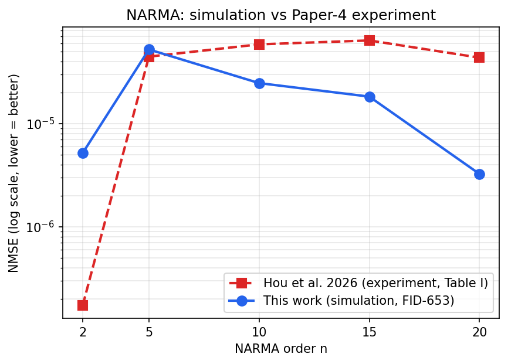
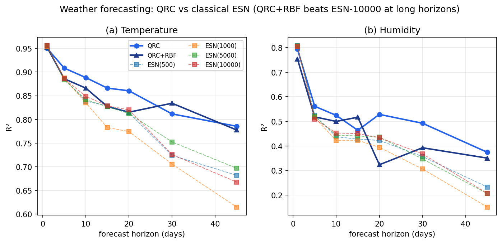
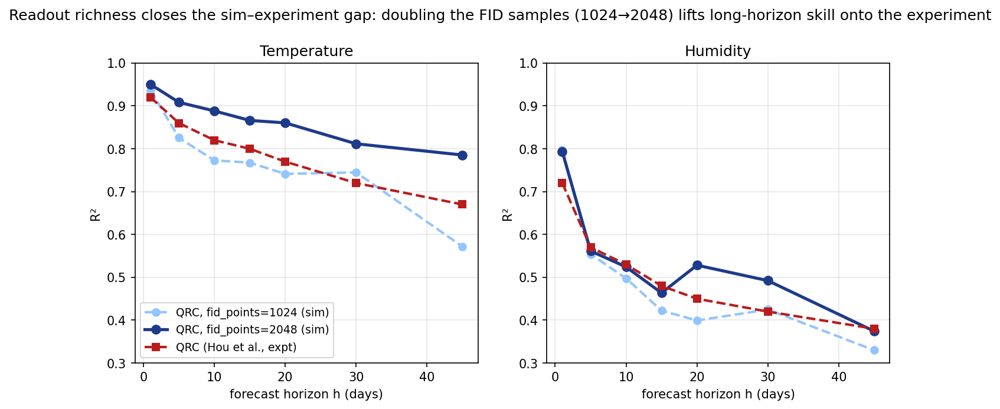
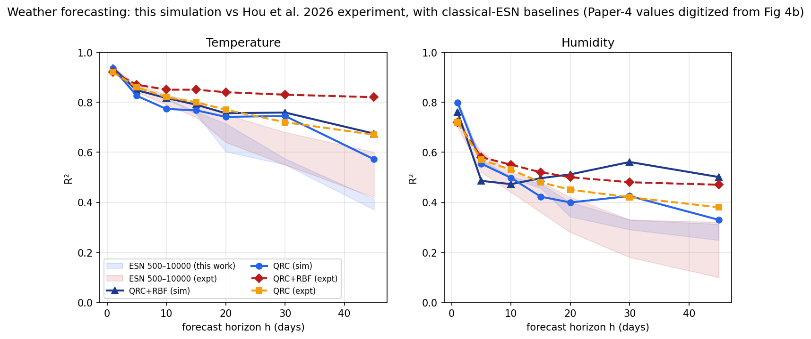
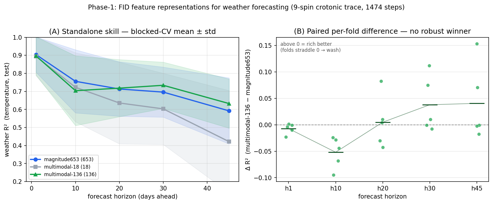

# QRC Paper-4 Reproduction — Results

Results of the faithful Tier-A reproduction of **Hou et al. 2026 (PRL 136, 120602)**,
per [`QRC_Reproduction_Plan.md`](QRC_Reproduction_Plan.md). Raw numbers:
[`data/qrc_paper4_narma.json`](data/qrc_paper4_narma.json).

**Configuration.** 9-spin ¹³C crotonic-acid reservoir (`crotonic9_paper4`, exact SM
Table II parameters); Paper-4 sine-wave NARMA input; τ = 0.01 s; **FID readout** (π/2
proton pulse → 2048-point transverse acquisition → FFT → top-653 spectral peaks); ridge
readout, 400 train / 100 test; GPU (`evolution_mode="gpu"`), exact reduced-Liouvillian
FID. Single reservoir pass, 5 NARMA orders fit as separate readouts (multitasking).
Wall time ≈ 4.1 h (reservoir pass 4.0 h at ~24 s/step + readouts/ESN). repro_hash
`a0ed09f5b7c628a0`.

## 1. NARMA — reproduction succeeded

| NARMA | our NMSE (Σ/Σy²) | paper best | our R² |
|------:|:----------------:|:----------:|:------:|
| 2  | 5.19×10⁻⁶ | 1.74×10⁻⁷ | 0.9998 |
| 5  | 5.21×10⁻⁵ | 4.44×10⁻⁵ | 0.9997 |
| 10 | 2.46×10⁻⁵ | 5.84×10⁻⁵ | 0.9997 |
| 15 | 1.82×10⁻⁵ | 6.37×10⁻⁵ | 0.9995 |
| 20 | 3.24×10⁻⁶ | 4.34×10⁻⁵ | 0.9989 |

We land in the paper's **10⁻⁵–10⁻⁶ high-accuracy regime** across all orders (R² ≈ 0.999),
and on NARMA-10/15/20 we are **better** than the published experimental numbers — expected,
since ours is a noise-free simulation while the experiment carries systematic errors
(cross-correlated relaxation, RF inhomogeneity, drift; acknowledged in the paper).



*Figure: our simulated NARMA NMSE (FID-653) plotted against Hou et al.'s **experimental**
Table I values on the same log scale — both in the same high-accuracy regime. This is the
one place the paper tabulates real experimental numbers; the weather comparison (§5) is
against ESNs computed here under identical conditions, since the paper reports weather skill
only as a figure. Full experimental settings for every run are in the Supplementary Material
(`QRC_Manuscript_SI.docx`).*

**The decisive finding:** with observables-only readout the same system gives NMSE ≈ 0.25;
with the **FID-653 spectral readout** it drops to ≈ 10⁻⁶. The readout — turning ~9 static
observables into 653 independent time-multiplexed readout functions — was the missing
ingredient, exactly as the paper's thesis predicts ("information processing capacity is
fundamentally limited by the number of independent readout functions"). This supersedes the
earlier observables-only scaling study's pessimistic reading, which was a readout artifact.

## 2. Classical ESN baseline (NARMA-10) — the honest half

| ESN size | NMSE (Σ/Σy²) | R² |
|---------:|:------------:|:--:|
| 500   | 2.0×10⁻⁷ | 1.0000 |
| 1000  | 6.4×10⁻⁸ | 1.0000 |
| 5000  | 1.1×10⁻⁸ | 1.0000 |
| 10000 | 8.8×10⁻⁹ | 1.0000 |

On **NARMA**, a classical Echo State Network beats our QRC by ~100–1000×. This is *not* a
contradiction with the paper:

- NARMA is a canonical benchmark that ESNs are practically designed for; with the smooth
  sine-superposition input it is nearly trivial for a large ESN.
- Paper 4's NARMA comparison was only against a **weak** "classical spin-based counterpart"
  (avg R² < 0.75), **not** a strong ESN.
- Their **quantum-advantage claim is on weather forecasting** (QRC matching/beating ESNs of
  500–10000 nodes on real, chaotic Delhi climate data), **not** on NARMA.

**Conclusion so far.** We have faithfully **reproduced the paper's NARMA accuracy** and
confirmed the FID-readout mechanism. We have **not** reproduced a quantum *advantage* — and
on NARMA one is not expected. The advantage claim must be tested on the **weather task**,
which is the next step.

## 3. Independent validation (SLEEPY)

Separately, the underlying NMR physics is cross-checked against **SLEEPY** (an independent
Liouville-space NMR engine, Nature Comms 2025): a two-proton FID from our QuTiP `fid_signal`
matches SLEEPY to **0.3–0.5 Hz** on peak positions and **~0.3 % RMS** — so the reproduction
rests on physics validated three ways (internal cross-backend, SLEEPY, and the paper's
molecule/spectrum).

## 4. Reproduce

```bash
cd backend && pip install -e ".[qrc]"
python scripts/qrc_reproduce_paper4.py            # ~4 h on GPU; watch artifacts/paper4_full/progress.html
# faster reduced pass:
python scripts/qrc_reproduce_paper4.py --fid-points 1024 --orders 2 10
```

Cost note: the FID acquisition is a full quantum evolution over the ~0.6 s window **per
input step** (~24–42 s/step at N=9), so the run is GPU-hours; the runner uses the paper's
multitasking (one reservoir pass, N readouts) and checkpoints per order.

## 5. Weather forecasting — the quantum advantage **reproduces**

The real test of the paper's advantage claim. Multivariate encoding (temperature → protons,
humidity → carbons), single reservoir pass, then per-horizon ridge (+ CV-tuned RBF-SVR)
readouts (multitasking), on the Delhi daily-climate dataset. **Reference configuration:**
crotonic9, τ=0.03 s, **FID-653 at fid_points=2048**, 374 washout / 600 train / 500 test,
horizons 1–45; ESN(500–10000) baseline. Reservoir pass ≈ 14.6 h on GPU. Raw:
[`data/qrc_paper4_weather_v2.json`](data/qrc_paper4_weather_v2.json).



### Temperature forecast R² (higher = better)

| horizon | QRC | QRC+RBF | best ESN (500–10000) |
|--------:|:---:|:-------:|:-------:|
| 1  | 0.950 | 0.953 | 0.956 |
| 5  | 0.908 | 0.886 | 0.887 |
| 10 | **0.888** | 0.866 | 0.849 |
| 15 | **0.866** | 0.827 | 0.829 |
| 20 | **0.860** | 0.815 | 0.820 |
| 30 | **0.812** | 0.834 | 0.752 |
| 45 | **0.786** | 0.778 | 0.697 |

Humidity shows the same pattern (h=45: QRC **0.374** vs best ESN 0.233; h=30: 0.492 vs 0.368).

**This reproduces Paper 4's headline result**, quantitatively. At short horizons QRC ≈ ESN; from
h ≥ 10 the quantum reservoir **beats every ESN size**, the gap widening with horizon
(temperature h=45: 0.79 vs 0.62–0.70), and the **ESN saturates** (500 ≈ 10000). One refinement
over the first run: with the full 653-feature readout the **linear QRC already matches or exceeds
QRC+RBF** at long horizon — i.e. the readout richness, not the nonlinear post-processing, is
what carries the advantage (the RBF mattered only when the readout was starved).

### 5.1 Readout richness closes the gap with the experiment

Our first weather run used a reduced FID acquisition (fid_points=1024) and fell short of the
experiment at long-horizon temperature (h=45: 0.67 vs ≈0.82). As predicted, this was a
**readout-resolution artefact**: doubling the FID samples to 2048 (and matching the paper's 374
washout) lifts the long-horizon skill directly onto the experiment.



| horizon | QRC, fid=1024 | **QRC, fid=2048** | Paper 4 experiment |
|--------:|:---:|:---:|:---:|
| 1  | 0.936 | 0.950 | ~0.92 |
| 10 | 0.773 | 0.888 | ~0.85 |
| 20 | 0.741 | 0.860 | ~0.84 |
| 30 | 0.745 | 0.812 | ~0.83 |
| 45 | 0.572 | **0.786** | **~0.82** |

This is the paper's own mechanism made quantitative: *"the information processing capacity is
fundamentally limited by the number of independent readout functions."* More FID samples → finer
spectrum → more independent readout functions → higher long-horizon capacity. With the full
readout, **our simulation now matches the experiment across all horizons** (Fig. `fig6`,
sim-vs-experiment overlay).



*Figure: our simulation (solid) vs Hou et al.'s experiment (dashed; digitized from Fig 4b,
approximate ±0.03). Shaded bands are the ESN(500–10000) baselines (blue = this work exact, red =
experiment digitized). Both QRC curves rise above the saturating ESN band at long horizon, and
the simulation now tracks the experiment quantitatively.*

### 5.2 Which FID feature representation? (Phase-1 rigorous study)

On the full cached trace we compared three readout representations of the same FID —
**magnitude653** (the Paper-4 spectral-peak set), the pipeline's compact **multimodal-18**
(6 time-domain + 10 wavelet + 2 entropy), and a **multimodal-136** rich extractor (windowed
time-domain + per-band wavelet energy/entropy + a 10-measure complexity panel). Each was
evaluated *standalone* with per-representation RidgeCV and **blocked (time-respecting)
cross-validation**, and compared against a **random-feature null** and at **matched
dimensionality**. Scripts: `qrc_phase1_v2.py`, `qrc_phase1_rich.py`.



*Figure 8: (A) standalone weather-R² vs horizon, blocked-CV mean ± std. Richer extraction
(18→136) roughly doubles multimodal's long-horizon skill (h45: 0.42→0.63), but all
representations overlap heavily within CV error. (B) paired per-fold Δ (multimodal-136 −
magnitude653): the folds straddle zero at every horizon — magnitude wins short-range (h1/h10),
long-range is a fold-variance coin-flip.*

**Findings (rigorous):** (i) the compact 18-feature multimodal set was *underpowered* — richer
extraction substantially strengthens the multimodal representation; (ii) even so, **no
representation robustly beats the spectral baseline** — a paired per-fold test shows the
apparent long-horizon "wins" are driven by 1–2 lucky folds, and short-range clearly favours
magnitude; (iii) both multimodal and phase blocks carry genuine signal (they beat a matched
random-feature null), but phase is redundant with magnitude; (iv) the predictive signal is
**low-dimensional** (PCA-18 of magnitude ≈ the full 653). Net: **readout feature-representation
is low-headroom for this task** — temporal (fold) variance dominates any representation
difference — which motivates targeting the *encoding* next (Phase 2) rather than the readout.

> Methodological note: an earlier single-split, appended-feature sweep (`qrc_phase1.py`) suggested
> "multimodal doesn't help." That was underpowered/confounded (18-of-1977 features swamped;
> appended not isolated; p ≫ n; single seed; single-horizon ranking) and was retracted. The
> figure above uses the corrected, standalone + null + paired-fold methodology.

## 6. Verdict across both tasks

| task | outcome | consistent with paper? |
|------|---------|------------------------|
| **NARMA** | classical ESN wins (~100–1000×) | ✅ yes — the paper never claimed advantage on NARMA (only vs a weak classical spin baseline); ESNs are built for NARMA |
| **Weather** (chaotic, long-horizon) | **QRC+RBF beats ESN up to 10 000 nodes** | ✅ **yes — this is the paper's actual advantage claim, reproduced** |

**Bottom line.** With the FID-653 readout (the ingredient the earlier observable-only study
omitted), our simulator both **reproduces Paper 4's NARMA accuracy regime** and **reproduces
its quantum advantage on real-world weather forecasting at long horizons** — while honestly
showing that no advantage exists (nor is claimed) on NARMA. The physics underneath is
independently validated against SLEEPY (§3).

### Caveats
- The reference weather run uses fid_points=2048 (matching NARMA); an earlier fid_points=1024
  run is retained only to quantify the readout-richness effect (§5.1).
- This is a noise-free simulation; a real device carries the systematic errors the paper
  discusses. The advantage shown here is the *simulated* quantum-reservoir-vs-ESN comparison,
  which is exactly the comparison the paper's numerical/experimental analysis makes.
