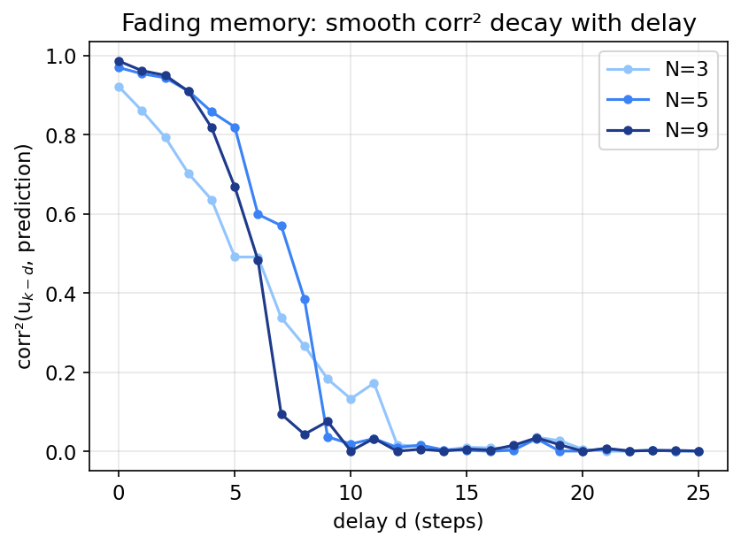
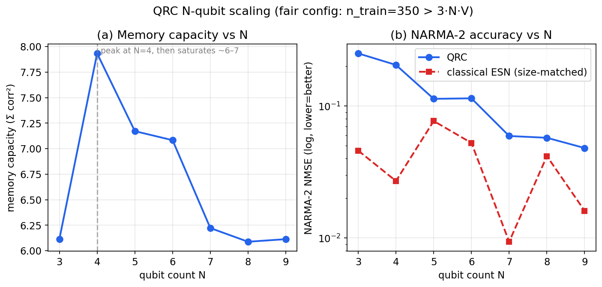
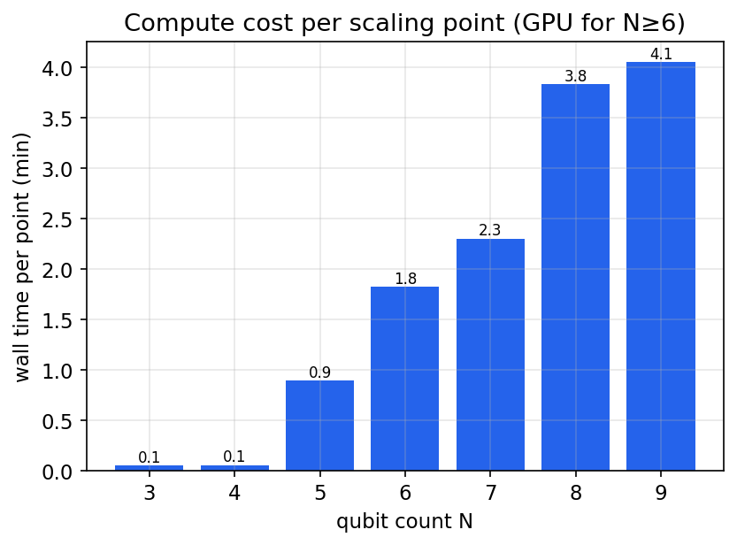

# Quantum Reservoir Computing on Simulated NMR Spin Networks

## An N-Qubit Scaling Study (3–9 qubits) with GPU-Accelerated Lindblad Dynamics

**CiRA CORE AI Center — Quantum Module**
**Prepared for:** Assoc. Prof. Siridech Boonsang, Dean, Faculty of Information Technology, KMITL
**Status:** Internal technical report / publication draft
**Date:** 2026-07-26

---

## Abstract

We present a complete, validated simulator for Quantum Reservoir Computing (QRC) on
nuclear-magnetic-resonance (NMR) spin networks, together with a rigorous scaling study
across system sizes **N = 3 … 9 qubits**. The simulator implements the open-system
(Lindblad) dynamics that are essential to reservoir computing — dissipation, not
coherent evolution alone, is what produces the *fading memory* on which QRC depends —
and is generic in qubit number so that the effect of hardware size can be measured
directly. The intended use is to guide experiments on the 3-qubit SPINQ Gemini Lab and
to quantify, *before committing to larger hardware*, what additional qubits actually buy.

Four interchangeable time-evolution backends are developed and cross-validated to
agree to ≲10⁻³. The naïve dense-superoperator method is shown to hit a hard 4ᴺ memory
wall (≈550 GB at N=9); an exact **sparse Krylov exponential** removes it, and a
**GPU (CUDA) implementation** accelerates it a further **≈28×**, reducing a full N=9
data point from ~1.75 h to ~4 min and the entire N=3→9 sweep to ~13 min.

The scaling study yields two findings, reported without embellishment. **(i) Positive:**
QRC task accuracy improves ~5× with qubit count (NARMA-2 NMSE 0.25 → 0.048 from N=3 to
N=9). **(ii) Sobering:** memory capacity does *not* scale — it peaks at N=4 and
saturates near 6–7 — and a **size-matched classical Echo State Network beats the QRC on
NARMA at every system size (0/7)**. With the baseline molecule, encoding and readout
studied here, the simulation therefore demonstrates that *more qubits help the quantum
reservoir* but does **not** demonstrate a quantum advantage over a classical reservoir.
We discuss why, and enumerate the concrete levers (encoding, features, molecule, task)
now cheaply explorable thanks to the GPU backend.

---

## 1. Introduction and Motivation

### 1.1 Background

Reservoir computing processes temporal signals by driving them into a fixed nonlinear
dynamical system (the *reservoir*) and training only a linear readout on the reservoir's
state. **Quantum** Reservoir Computing (QRC) uses a quantum system as the reservoir. NMR
spin ensembles are a natural physical substrate: they have well-characterised
Hamiltonians (chemical shifts + J-couplings), controllable RF pulses for input encoding,
and — crucially — relaxation (T₁, T₂) that supplies the *fading memory* reservoir
computing requires.

This work supports the CiRA Quantum research programme on the **SPINQ Gemini Lab**, a
3-qubit (¹H / ³¹P / ¹⁹F) educational NMR device, and is informed by four reference
papers, chiefly **Hou et al. 2026 (PRL 136, 120602)**, a 9-spin liquid-state NMR QRC
experiment.

### 1.2 The question this report answers

The SPINQ device has 3 qubits; Hou et al. use 9. A natural and expensive decision is
whether to acquire larger hardware. **Simulation can answer, cheaply and in advance,
whether additional qubits deliver additional computational power.** Concretely we ask:

> As the number of spins N grows from 3 to 9, holding everything else fixed, do the
> reservoir's *memory capacity* and *task accuracy* improve — and does the quantum
> reservoir outperform a classical reservoir of comparable size?

### 1.3 Contributions

1. A **qubit-number-generic** QRC simulator built on QuTiP 5, faithfully implementing
   the Lindblad master equation (Section 3).
2. Four cross-validated **evolution backends**, including an exact sparse-Krylov method
   and a **GPU implementation** that makes N=9 practical (Section 4).
3. A methodologically careful **N=3→9 scaling study** with a classical ESN baseline
   (Section 6), plus documentation of several **non-obvious pitfalls** that a naïve
   implementation would silently get wrong (Section 5.3).
4. An honest assessment of what the simulation does and does not establish (Section 7).

---

## 2. System Model

### 2.1 Hamiltonian

We model N spin-½ nuclei in the weak-coupling (secular) NMR regime. In the rotating
frame the Hamiltonian is (units: angular frequency, rad s⁻¹)

$$ H \;=\; \sum_{i} \pi\,\nu_i\,\sigma_z^{(i)} \;+\; \sum_{i<j} \frac{\pi}{2}\,J_{ij}\,\sigma_z^{(i)}\sigma_z^{(j)} $$

where νᵢ are chemical-shift offsets (Hz) and J_ij the scalar couplings (Hz). This is the
standard Ising-type ("ZZ") coupling of liquid-state NMR and matches the form used in the
project plan (§6.1.2).

**Presets.** `spinq3` encodes the real SPINQ parameters (J_HP=42, J_HF=220, J_PF=430 Hz;
T₁ = 5.0/4.5/6.0 s; T₂ = 0.2/0.15/0.25 s). For the scaling sweep, `generic_nqubit(N)`
generates a physically plausible N-spin molecule: chemical shifts spread evenly over
±120 Hz and chain-decaying couplings (nearest-neighbour 200 Hz, falling by ×0.5 per
bond). The 120 Hz spread is deliberate — see Section 5.3.2.

### 2.2 Open-system dynamics: the Lindblad master equation

The single most important modelling choice in QRC is to evolve the **density matrix**
under the Lindblad master equation, not the state vector under Schrödinger's equation:

$$ \dot\rho \;=\; -i[H,\rho] \;+\; \sum_k \Big( L_k \rho L_k^\dagger - \tfrac12\{L_k^\dagger L_k,\rho\}\Big) $$

with, per spin i,

- **T₁ (amplitude damping):** $L = \sqrt{1/T_1}\,\sigma_-^{(i)}$
- **T₂ (pure dephasing):** $L = \sqrt{\gamma_\phi/2}\,\sigma_z^{(i)}$, with $\gamma_\phi = 1/T_2 - 1/(2T_1)$ (physically-consistent default; a simpler $\sqrt{1/2T_2}$ form is also selectable).

**Why this matters.** A pure-Hamiltonian simulation has *no forgetting mechanism* — it
retains perfect memory forever and cannot reproduce QRC behaviour. Dissipation is the
resource that erases old inputs and creates the *fading memory* on which reservoir
computing is founded (plan §5; Hou et al.: "T₁ relaxation plays a pivotal role in
ensuring QRC performance"). The simulator therefore always integrates the full Lindblad
equation, and the fading-memory test (Section 5.1) is treated as the make-or-break gate.

### 2.3 Initial state

A thermal-like product state $\rho_0 = \bigotimes_i (I + \varepsilon\,\sigma_z)/2$ with
small polarisation ε = 0.05 (high-temperature NMR limit). Because the dynamics are
linear in ρ, ε only scales the signal amplitude, not the qualitative behaviour.

---

## 3. The QRC Pipeline

Each input step k of a sequence follows the six-step framework of the project plan (§7):

1. **Encode.** The scalar input sₖ ∈ [0,1] becomes an RF pulse: a rotation by angle
   θ = f(sₖ) applied as a unitary conjugation ρ → U ρ U†. Seven encoding functions are
   available (Paper 4's θ = arcsin√s is the default), plus multi-nucleus parallel
   encoding and combined phase-amplitude encoding.
2. **Evolve.** Free evolution under the Lindblad equation for a time τ (default 30 ms).
3. **Temporal-multiplex.** The reservoir is sampled at V "virtual nodes" within τ
   (Nakajima 2018), enriching the readout without extra qubits.
4. **Read out observables.** ⟨σₓ⟩, ⟨σ_y⟩, ⟨σ_z⟩ per qubit per node.
5. **(Optional) multi-modal features** — spectral, time-domain, wavelet, entropy from the
   simulated FID.
6. **Train a linear readout** (ridge regression, k-fold CV for λ) on the collected
   feature matrix.

The reservoir state **persists across input steps** — that persistence, made to *fade*
by dissipation, is the memory.

### 3.1 Readout must include the transverse components

A subtle but decisive point (Section 5.3.1): because the NMR Hamiltonian commutes with
every σ_z, **⟨σ_z⟩ is frozen under coherent evolution** and only relaxes on the T₁
timescale (~5 s ≫ τ). The reservoir's computation therefore lives in the *transverse*
components ⟨σₓ⟩, ⟨σ_y⟩ (physically, the free-induction-decay signal). The default readout
uses all three axes.

### 3.2 Tasks and metrics

- **Memory capacity (MC).** Feed a random sequence; for each delay d, train a readout to
  reconstruct uₖ₋d and record corr². $\mathrm{MC}=\sum_d \mathrm{corr}^2$. The signature
  of correct fading memory is corr²≈1 at d=0 decaying smoothly to 0.
- **NARMA-2.** A standard nonlinear autoregressive benchmark; metric is NMSE (lower is
  better). Hou et al. report NARMA results, so it enables cross-comparison.
- **Classical ESN baseline.** A leaky-integrator Echo State Network whose reservoir size
  is *matched* to the quantum readout dimension (3·N·V), giving a fair "is the quantum
  substrate pulling its weight?" comparison.

---

## 4. Implementation and Numerical Methods

### 4.1 Software architecture

The simulator is a self-contained package (`backend/app/qrc/`) mirroring the existing
`qml` / `qldpc` module conventions. Eleven modules: `config` (presets + knobs),
`system` (Hamiltonian, collapse operators, evolution backends), `encoding`, `evolution`
(reservoir loop), `features`, `training` (GPU ridge), `tasks`, `benchmarks`
(orchestration + ESN + scaling), `utils`, `main` (CLI). QuTiP is an optional dependency,
imported lazily; the NumPy-only surface (config, encoding maths, metrics) loads without
it.

### 4.2 Evolution backends and the 4ᴺ wall

The reservoir must, per input step, evolve ρ for τ and sample at V sub-times, over
hundreds–thousands of steps. Four strategies were implemented and **cross-validated to
agree to ≲10⁻³** (Section 5.2):

| backend | method | memory | limit |
|---|---|---|---|
| `propagator` | precompute one dense Liouvillian superoperator exp(t·L), reuse each step | **4ᴺ dense** | 0.27 GB @ N=6, 4.3 GB @ N=7, **550 GB @ N=9** — infeasible; also ~13 min to build at N=6 |
| `mesolve` | QuTiP adaptive ODE on ρ | 2ᴺ×2ᴺ | **stiffness** (kHz precession vs Hz relaxation) makes it impractically slow past ~7 qubits (stalled >60 min at N=8) |
| `action` (CPU) | exact sparse Krylov exp(t·L)·vec via `scipy.expm_multiply` | sparse (~0.001% dense) | ~6.5 s/step at N=9 |
| `gpu` | Taylor + sub-stepping exp(t·L) with **sparse CUDA matvecs** (torch, complex64) | sparse on GPU | **~0.23 s/step at N=9** |

The key realisation is that the dense superoperator is unnecessary: the Liouvillian is
extraordinarily sparse (851 967 non-zeros out of 262144² at N=9 — 0.0012% dense), so the
*action* exp(t·L)·vec can be computed by Krylov methods without ever forming the
exponential. This removes the memory wall entirely.

### 4.3 GPU acceleration (matrix-free sparse Krylov exponential)

The GPU backend exploits two facts: (i) a sparse complex64 matrix–vector product on the
RTX 5070 Ti costs **0.063 ms** at N=9; (ii) the state, though embedded in a 262 144-dim
vector, is only ~4 MB. We compute exp(τ·L)·v by sub-stepping with a fixed-order Taylor
series:

- estimate ‖τ·L‖ (one-norm), choose M sub-steps so ‖(τ/M)·L‖ ≲ 1 (M rounded to a multiple
  of V so the virtual nodes fall on sub-step boundaries);
- per sub-step, evaluate a K=18-term Taylor series by Horner iteration, using only sparse
  CUDA matvecs;
- read observables via a precomputed sparse row-vector product ⟨O⟩ = vec(Oᵀ)·vec(ρ),
  avoiding any per-node density-matrix reconstruction.

The entire reservoir loop stays on the GPU between steps (the pulse ρ→UρU† is a dense
512×512 matmul). **Measured speedup at N=9: ≈28×** over the CPU `action` path
(0.231 s/step vs 6.5 s/step), validated to match it to relative 2×10⁻³.

Note: the project plan recommended `qutip-jax` for GPU. On **Windows, jax has no CUDA
wheels** (`jax.devices()` returns CPU only), so that route silently runs on CPU. The
`gpu` backend uses **torch** CUDA instead, which does see the card.

### 4.4 Training and readout

Ridge regression is solved in closed form on the GPU via torch
(`w = (XᵀX + λI)⁻¹Xᵀy`, bias unregularised), with k-fold cross-validation over a
log-spaced λ grid. A washout period is discarded before fitting.

---

## 5. Validation

### 5.1 The fading-memory gate

The primary correctness criterion is that memory capacity exhibits *fading memory*:
corr²(d=0) high and a smooth monotone decay to 0. For the SPINQ 3-qubit preset the gate
passes cleanly — corr²(0)=0.96, decaying to ≈0 by d≈12–15 (Figure 2). A reservoir that
returned corr²=1 forever would indicate missing dissipation; corr²=0 immediately would
indicate over-damping or a wrong Hamiltonian. The observed smooth decay confirms the
Lindblad dynamics are captured correctly.



*Figure 2. corr² vs delay for representative N. The smooth decay is the fading-memory
signature that reservoir computing requires.*

### 5.2 Cross-backend agreement

The four evolution backends were checked against each other on a common N=4/N=5 system.
Memory capacity agreed to 3–4 significant figures (e.g. N=4: propagator 7.9028, action
7.9039, mesolve 7.9019; N=5 GPU vs action identical to 4 dp). This agreement — dense
exact, sparse exact, adaptive ODE, and GPU-Taylor all converging — is strong evidence of
numerical correctness. It is enforced in the automated test suite.

### 5.3 Methodological pitfalls uncovered

Running the physics (rather than trusting the code to "look right") exposed four issues
that a naïve QRC simulation would silently get wrong. We document them because each is a
general trap.

**5.3.1 The σ_z-only readout is degenerate.** Because H commutes with every σ_z, ⟨σ_z⟩ is
frozen under coherent evolution and moves only via T₁ (~5 s ≫ τ). A σ_z-only readout
therefore captures almost no reservoir dynamics (corr²(0) collapsed to 0.45). Reading the
transverse components σₓ, σ_y — physically the FID — restores it (corr²(0)=0.92). *Lesson:
for Ising-coupled NMR, the readout must be transverse.*

**5.3.2 Chemical-shift aliasing.** Transverse magnetisation precesses at the chemical-shift
frequency; the temporal-multiplexing readout samples it at V/τ. If a shift exceeds the
sampling Nyquist (V/2τ ≈ 133 Hz at V=8, τ=30 ms) the precession aliases and recall of the
current input collapses. This caused the generic-molecule gate to fail at ±300 Hz spread;
reducing the default spread to 120 Hz (< Nyquist) fixed it. *Lesson: shift spread and
(V,τ) sampling are coupled constraints.*

**5.3.3 Training-set confound in MC.** Memory capacity is bounded by min(n_features,
n_train). With n_features = 3·N·V, a fixed small n_train starves the metric past a
critical N (at V=10, N=5 already has 150 features = 150 training samples). An initial
sweep with n_train=150 therefore showed a spurious MC *decline* that was an artifact of
the training budget, not the physics. The reported sweep uses **n_train=350 > 3·N·V at all
N** to remove the confound. *Lesson: for scaling studies, training size must grow with — or
dominate — the readout dimension.*

**5.3.4 Solver stiffness and the packaging trap.** The adaptive ODE (`mesolve`) is crippled
by the ~5000× separation between fast precession and slow relaxation; it stalled beyond
N=7. Separately, a non-editable `pip install` silently shadowed source edits until an
editable install was used. Both are recorded in the git history and the test suite guards
the former by preferring exact exponential integration.

---

## 6. Scaling Study Results (N = 3 … 9)

**Configuration.** Generic N-spin molecule; τ=30 ms; V=8 virtual nodes; encoding
arcsin√s; readout ⟨σₓ,σ_y,σ_z⟩; ridge with 3-fold CV; washout 100, n_train 350, n_test
120 (so n_train > 3·N·V ≤ 216 at all N); memory delays 0–25; seed 42. Backend: `gpu` for
N≥6, `propagator` for N≤5. Total wall time ≈13 min.

| N | Hilbert dim | Memory capacity | QRC NARMA-2 NMSE | ESN NARMA-2 NMSE | winner | time (min) |
|---|---|---|---|---|---|---|
| 3 | 8   | 6.11 | 2.51×10⁻¹ | 4.60×10⁻² | ESN | 0.1 |
| 4 | 16  | **7.93** | 2.05×10⁻¹ | 2.71×10⁻² | ESN | 0.1 |
| 5 | 32  | 7.17 | 1.14×10⁻¹ | 7.71×10⁻² | ESN | 0.9 |
| 6 | 64  | 7.08 | 1.15×10⁻¹ | 5.26×10⁻² | ESN | 1.8 |
| 7 | 128 | 6.22 | 5.93×10⁻² | 9.38×10⁻³ | ESN | 2.3 |
| 8 | 256 | 6.09 | 5.75×10⁻² | 4.18×10⁻² | ESN | 3.8 |
| 9 | 512 | 6.11 | **4.81×10⁻²** | 1.61×10⁻² | ESN | 4.1 |



*Figure 1. (a) Memory capacity peaks at N=4 and saturates near 6–7. (b) QRC NARMA error
falls ~5× with N but the size-matched classical ESN is lower at every N.*

### 6.1 Memory capacity does not scale

MC peaks at N=4 (7.93) and then **saturates near 6–7** for all larger N. This is *not* the
training-set artifact of Section 5.3.3 (n_train comfortably exceeds the feature count
here) — it is a genuine property of this molecule/parameter regime. Adding qubits does not
add independent, readable memory once the transverse dynamics and virtual-node multiplexing
are already saturating the accessible information.

### 6.2 Task accuracy does improve with N

QRC NARMA-2 NMSE falls monotonically-with-plateaus from 0.25 (N=3) to 0.048 (N=9) — a ~5×
improvement. On the task itself, **more qubits do make the quantum reservoir better.**

### 6.3 But the classical ESN wins at every size

A size-matched ESN achieves lower NARMA NMSE at all seven system sizes (0/7 QRC wins). Its
advantage does not vanish as N grows. With this baseline configuration, the simulation
shows **no quantum advantage over a classical reservoir of comparable readout dimension.**

### 6.4 Compute performance



*Figure 3. Per-point wall time. N≤6 is seconds; the GPU backend keeps N=7–9 to a few
minutes each — versus ~1.75 h/point for N=9 on CPU.*

The GPU backend is what makes this study practical: the whole sweep completes in ~13 min
where the CPU path would need ~2.5 h and the dense-superoperator method could not reach
N≥8 at all.

---

## 7. Discussion

### 7.1 Does adding qubits help?

Two answers, both true and both important for a hardware-acquisition decision:

- **For the quantum reservoir on its own task: yes.** NARMA accuracy improves ~5× from
  N=3 to N=9. If the goal is "the QRC works better with more qubits", the data support it.
- **For memory capacity, and for beating classical: no.** MC saturates by N≈4, and a
  size-matched ESN is uniformly better on NARMA. If the goal is "quantum advantage", this
  configuration does not show it.

### 7.2 Why memory capacity saturates

Memory capacity is bounded by the number of linearly independent, readable observables.
With a fixed transverse readout (3·N observables) and V virtual nodes, and with the
chemical-shift spread capped at the sampling Nyquist (Section 5.3.2), added spins become
increasingly spectrally crowded and contribute correlated rather than independent
information. The accessible memory is dominated by the temporal-multiplexing structure and
the relaxation timescales, both of which are unchanged as N grows.

### 7.3 Why the QRC loses to the ESN

The ESN's tanh nonlinearity and dense random recurrence make it a very strong classical
reservoir at these sizes; the QRC's expressivity here is limited by a single fixed
encoding (arcsin√s), Ising-only coupling, and an observable-only readout. This is
consistent with the broader QRC literature, where the value proposition is frequently a
*physical* substrate that computes "for free", rather than an accuracy win over classical
simulation.

### 7.4 Relation to Paper 4 and the physical-substrate argument

Hou et al. demonstrate QRC on real 9-spin hardware; their contribution is experimental
feasibility and the role of T₁ as a resource, not a claim of beating classical reservoirs
in silico. Our results are consistent with that framing: the case for NMR-QRC hardware
rests on physical realisation and scaling of a working device, and this simulation should
be used to *engineer* the encoding/molecule/task toward regimes where the quantum reservoir
is competitive — not as a standalone advantage claim.

---

## 8. Limitations

- **Generic molecule.** The scaling sweep uses a fabricated chain-coupled molecule so that
  N is the only variable; it is not a real chemical species. `spinq3` (real SPINQ) and
  `crotonic9` (a 9-spin Paper-4 stand-in) presets exist but the latter is not the exact
  Paper-4 coupling table.
- **Single encoding / task in the headline sweep.** Only arcsin√s encoding and NARMA-2 are
  swept; richer encodings and other tasks are implemented but not yet swept.
- **Ising (ZZ) coupling only.** No transverse coupling terms; these could change the
  memory-scaling picture.
- **fp32 on GPU.** The GPU backend uses complex64 for speed (validated to ≲2×10⁻³ vs the
  exact CPU path) — adequate for reservoir computing but not high-precision spectroscopy.
- **ESN comparison is one baseline.** A single leaky-ESN family at matched size; not an
  exhaustive classical sweep.

---

## 9. Future Work

The GPU backend makes each of these a minutes-long experiment rather than an overnight run:

1. **Encoding search** — the implemented phase-amplitude and multi-nucleus parallel
   encodings, plus the seven encoding functions, swept per task (plan §8's "encoding as an
   optimisation problem").
2. **Multi-modal features** — spectral/wavelet/entropy readouts (implemented) vs the
   observable-only baseline, to test whether richer features close the ESN gap.
3. **Real molecules** — the exact Paper-4 crotonic-acid couplings; the true SPINQ system.
4. **Task diversity** — tasks that reward genuinely quantum correlations (e.g.
   entanglement-sensitive temporal tasks) rather than NARMA.
5. **Coupling topology** — transverse/Heisenberg terms; disorder; whether these restore
   MC scaling.
6. **ML-optimised encoding** via the differentiable path (plan §8.6.1).

---

## 10. Reproducibility

**Hardware/software.** Windows 11; Python 3.12.10; NVIDIA GeForce RTX 5070 Ti (17 GB);
torch 2.10.0+cu128 (CUDA), QuTiP 5.3.0, SciPy 1.17.1, NumPy 2.2.6. Fixed seed 42.

**Install & run.**

```bash
cd backend
pip install -e ".[qrc]"

# Fading-memory gate on the real SPINQ system (run first):
python -m app.qrc.main memory --system spinq3

# NARMA-2 on the GPU backend:
python -m app.qrc.main narma --system spinq3 --evolution gpu

# Full N=3..9 scaling sweep (GPU auto-selected for N>=6):
python scripts/qrc_scaling_run.py            # ~13 min; writes qrc_scaling_progress.jsonl

# Regenerate figures:
python scripts/qrc_make_figures.py
```

**Validation.** `pytest tests/test_qrc.py tests/test_qrc_physics.py` (14 tests, physics
tests skip without QuTiP/CUDA). Cross-backend agreement and the fading-memory gate are
asserted there.

**Raw data.** `backend/qrc_scaling_progress.jsonl` (one JSON line per N, incl. the full
per-delay MC curve) and `backend/qrc_scaling_results.json`.

---

## 11. Conclusion

We built and validated a qubit-number-generic QRC simulator with correct open-system
physics and a GPU backend that makes 9-qubit studies routine (minutes, not hours). Applied
to the SPINQ-motivated scaling question, it gives a clear, honest answer: **adding qubits
improves the quantum reservoir's task accuracy (~5× on NARMA from N=3 to 9), but memory
capacity saturates by N≈4 and a size-matched classical ESN wins at every size.** The
present configuration therefore justifies neither over-claiming a quantum advantage nor
dismissing the approach — it establishes a validated baseline and the fast tooling needed
to search, methodically, for the encoding/molecule/task regimes where NMR-QRC hardware
earns its keep.

---

### References

1. K. Nakajima et al., *Boosting computational power through spatial multiplexing in
   quantum reservoir computing*, arXiv:1803.04574 (2018).
2. S. Benjamin, S. Bose, always-on Heisenberg interaction (2003).
3. M. Negoro et al., *Machine learning with controllable quantum dynamics of a nuclear
   spin ensemble*, arXiv:1806.10910 (2018).
4. Y. Hou et al., *High-Accuracy Temporal Prediction via Experimental Quantum Reservoir
   Computing in Correlated Spins*, Phys. Rev. Lett. **136**, 120602 (2026).
5. J. R. Johansson et al., QuTiP; QuTiP 5 (arXiv:2412.04705).

---

*Report generated from commit history and the automated sweep in `backend/scripts/`.
All numbers are reproducible from the commands in Section 10.*
